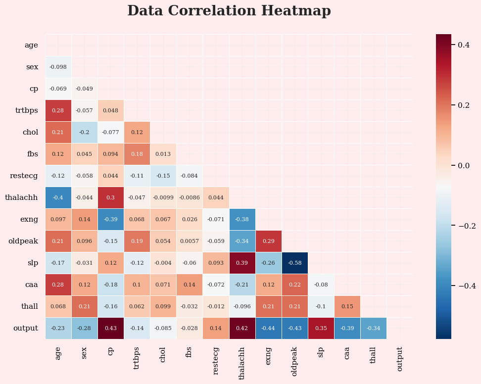
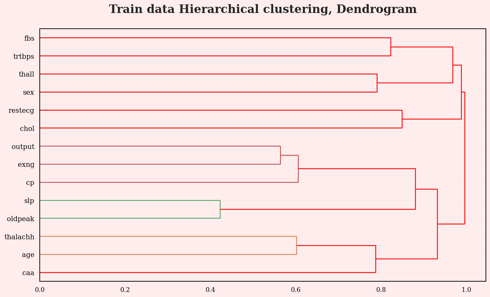

```python
import pandas as pd
import numpy as np
import matplotlib.pyplot as plt
import seaborn as sns
import gc
import re as re
from collections import Counter


```


```python
pip install xgboost

```

    Requirement already satisfied: xgboost in c:\users\darshini\.anaconda\new folder\lib\site-packages (2.0.3)
    Requirement already satisfied: numpy in c:\users\darshini\.anaconda\new folder\lib\site-packages (from xgboost) (1.24.3)
    Requirement already satisfied: scipy in c:\users\darshini\.anaconda\new folder\lib\site-packages (from xgboost) (1.11.1)
    Note: you may need to restart the kernel to use updated packages.
    

    
    [notice] A new release of pip is available: 23.3.1 -> 24.0
    [notice] To update, run: python.exe -m pip install --upgrade pip
    


```python
from tqdm.auto import tqdm
import math
from sklearn.linear_model import LogisticRegression
from sklearn.naive_bayes import GaussianNB
from sklearn.svm import SVC
from sklearn.neighbors import KNeighborsClassifier
from sklearn.tree import DecisionTreeClassifier, plot_tree
from sklearn.ensemble import RandomForestClassifier
from sklearn.ensemble import AdaBoostClassifier
from sklearn.ensemble import GradientBoostingClassifier
from sklearn.ensemble import BaggingClassifier
from xgboost import XGBClassifier
```


```python
from xgboost import plot_tree as xgb_plot_tree
from sklearn.model_selection import KFold, StratifiedKFold, train_test_split, GridSearchCV
from sklearn.preprocessing import StandardScaler, MinMaxScaler, RobustScaler, LabelEncoder
from sklearn.metrics import precision_recall_fscore_support, roc_auc_score, accuracy_score, confusion_matrix, ConfusionMatrixDisplay, RocCurveDisplay, roc_curve, auc


from scipy.cluster import hierarchy
from scipy.cluster.hierarchy import dendrogram, linkage
from scipy.spatial.distance import squareform

```


```python
import warnings
warnings.filterwarnings('ignore')

import time
from xgboost import XGBClassifier
%matplotlib inline
tqdm.pandas()

rc = {
    "axes.facecolor": "#FFEDED",
    "figure.facecolor": "#FFEDED",
    "axes.edgecolor": "#000000",
    "grid.color": "#EBEBE7",
    "font.family": "serif",
    "axes.labelcolor": "#000000",
    "xtick.color": "#000000",
    "ytick.color": "#000000",
    "grid.alpha": 0.4
}

font = {'family': 'serif',
        'color':  'black',
        'weight': 'bold',
        'size': 16,
        }

sns.set(rc=rc)

from colorama import Style, Fore
red = Style.BRIGHT + Fore.RED
blu = Style.BRIGHT + Fore.BLUE
mgt = Style.BRIGHT + Fore.MAGENTA
gld = Style.BRIGHT + Fore.YELLOW
res = Style.RESET_ALL
bold_start = Style.BRIGHT
bold_end = Style.NORMAL
```


```python
def describe(df):
    print(f'{bold_start}Data shape : {bold_end}{red}{df.shape}{res}')
    print(f'{bold_start}____________________________________________________________________{bold_end}')
    summ = pd.DataFrame(df.dtypes, columns=['data type'])
    summ['missing_#'] = df.isnull().sum().values 
    summ['missing_%'] = df.isnull().sum().values / len(df) * 100
    summ['unique'] = df.nunique().values
    desc = pd.DataFrame(df.describe(include='all').transpose())
    summ['mean'] = desc['mean'].values
    summ['std'] = desc['std'].values
    summ['min'] = desc['min'].values
    summ['25%'] = desc['25%'].values
    summ['50%'] = desc['50%'].values
    summ['75%'] = desc['75%'].values
    summ['max'] = desc['max'].values
    summ['1st'] = df.loc[0].values
    summ['2nd'] = df.loc[1].values
    summ['3rd'] = df.loc[2].values
    
    return summ

```


```python
def plot_count(df: pd.core.frame.DataFrame, col_list: list, title_name: str='Train') -> None:
    f, ax = plt.subplots(len(col_list), 2, figsize=(12, 5))
    plt.subplots_adjust(wspace=0.3)

    for col in col_list:
        s1 = df[col].value_counts()
        N = len(s1)
        outer_sizes = s1
        inner_sizes = s1/N
        outer_colors = ['#FF6347', '#20B2AA']
        inner_colors = ['#FFA07A', '#40E0D0']

        ax[0].pie(
            outer_sizes, colors=outer_colors, 
            labels=s1.index.tolist(), 
            startangle=90, frame=True, radius=1.2, 
            explode=([0.05]*(N-1) + [.2]),
            wedgeprops={'linewidth': 1, 'edgecolor': 'white'}, 
            textprops={'fontsize': 14, 'weight': 'bold'},
            shadow=True
        )

        ax[0].pie(
            inner_sizes, colors=inner_colors,
            radius=0.8, startangle=90,
            autopct='%1.f%%', explode=([.1]*(N-1) + [.2]),
            pctdistance=0.8, textprops={'size': 13, 'weight': 'bold', 'color': 'black'},
            shadow=True
        )

        center_circle = plt.Circle((0,0), .5, color='black', fc='white', linewidth=0)
        ax[0].add_artist(center_circle)
        sns.barplot(
            x=s1, y=s1.index, ax=ax[1],
            palette='coolwarm', orient='horizontal'
        )

        ax[1].spines['top'].set_visible(False)
        ax[1].spines['right'].set_visible(False)
        ax[1].tick_params(axis='x', which='both', bottom=False, labelbottom=False)
        ax[1].set_ylabel('')  # Remove y label
        ax[1].bar_label(ax[1].containers[0], color='black', fontweight='bold', fontsize=14)

        plt.setp(ax[1].get_yticklabels(), fontweight="bold")
        plt.setp(ax[1].get_xticklabels(), fontweight="bold")
        ax[1].set_xlabel(col, fontweight="bold", color='black', fontsize=14)

    f.suptitle(f'{title_name} Dataset Distribution of {col}', fontsize=20, fontweight='bold', y=1.05)
    plt.tight_layout()    
    plt.show()
```


```python
def plot_dist(df: pd.core.frame.DataFrame, col_list: list, target: str, title_name: str='Train') -> None:
    f, ax = plt.subplots(len(col_list), 2, figsize=(12, 5))
    plt.subplots_adjust(wspace=0.3)

    for col in col_list:
        ax[0] = sns.histplot(x=col, hue=target, data=df, bins=30, kde=True, palette='Reds')
        ax[1] = sns.boxplot(x=target, y=col, data=data)

    f.suptitle(f'{title_name} Dataset Distribution of {col}', fontsize=20, fontweight='bold', y=1.05)
    plt.tight_layout()    
    plt.show()
```


```python
def plot_correlation_heatmap(df: pd.core.frame.DataFrame, order:str='target', title_name: str='Train correlation') -> None:
    corr = df.corr()
    fig, axes = plt.subplots(figsize=(12, 8))
    mask = np.zeros_like(corr)
    mask[np.triu_indices_from(mask)] = True
    sns.heatmap(corr, mask=mask, linewidths=.5, cmap='RdBu_r', annot=True, annot_kws={"size": 8})
    plt.title(title_name, fontsize=20, fontweight='bold', y=1.05)
    plt.show()
```


```python
def perform_hierarchical_clustering(input_data, title):
    correlation_matrix = input_data.corr()
    distance_matrix = 1 - np.abs(correlation_matrix)
    Z = linkage(squareform(distance_matrix), 'complete')
    fig, ax = plt.subplots(1, 1, figsize=(14, 8), dpi=120)
    dn = dendrogram(Z, labels=input_data.columns, ax=ax, above_threshold_color='#ff0000', orientation='right', color_threshold=0.7*max(Z[:,2]))
    hierarchy.set_link_color_palette(None)  # Reset color palette to default
    plt.grid(axis='x')
    plt.title(f'{title} Hierarchical clustering, Dendrogram', fontsize=20, fontweight='bold', y=1.05)
    plt.show()
```


```python
Loading Data

```


```python
data = pd.read_csv(r"C:\Users\darshini\Downloads\archive\heart.csv")
data.head().style.background_gradient(cmap='Reds')
```


<style type="text/css">
#T_0661b_row0_col0, #T_0661b_row0_col1, #T_0661b_row0_col2, #T_0661b_row0_col3, #T_0661b_row0_col5, #T_0661b_row1_col1, #T_0661b_row1_col6, #T_0661b_row1_col7, #T_0661b_row1_col9, #T_0661b_row1_col12, #T_0661b_row2_col10, #T_0661b_row2_col12, #T_0661b_row3_col1, #T_0661b_row3_col6, #T_0661b_row3_col10, #T_0661b_row3_col12, #T_0661b_row4_col4, #T_0661b_row4_col6, #T_0661b_row4_col8, #T_0661b_row4_col10, #T_0661b_row4_col12 {
  background-color: #67000d;
  color: #f1f1f1;
}
#T_0661b_row0_col4 {
  background-color: #fdccb8;
  color: #000000;
}
#T_0661b_row0_col6, #T_0661b_row0_col7, #T_0661b_row0_col8, #T_0661b_row0_col10, #T_0661b_row0_col11, #T_0661b_row0_col12, #T_0661b_row0_col13, #T_0661b_row1_col0, #T_0661b_row1_col5, #T_0661b_row1_col8, #T_0661b_row1_col10, #T_0661b_row1_col11, #T_0661b_row1_col13, #T_0661b_row2_col1, #T_0661b_row2_col4, #T_0661b_row2_col5, #T_0661b_row2_col6, #T_0661b_row2_col8, #T_0661b_row2_col11, #T_0661b_row2_col13, #T_0661b_row3_col3, #T_0661b_row3_col5, #T_0661b_row3_col8, #T_0661b_row3_col11, #T_0661b_row3_col13, #T_0661b_row4_col1, #T_0661b_row4_col2, #T_0661b_row4_col3, #T_0661b_row4_col5, #T_0661b_row4_col9, #T_0661b_row4_col11, #T_0661b_row4_col13 {
  background-color: #fff5f0;
  color: #000000;
}
#T_0661b_row0_col9 {
  background-color: #f34935;
  color: #f1f1f1;
}
#T_0661b_row1_col2 {
  background-color: #e32f27;
  color: #f1f1f1;
}
#T_0661b_row1_col3, #T_0661b_row2_col3 {
  background-color: #fc8a6a;
  color: #f1f1f1;
}
#T_0661b_row1_col4 {
  background-color: #fca98c;
  color: #000000;
}
#T_0661b_row2_col0 {
  background-color: #fed8c7;
  color: #000000;
}
#T_0661b_row2_col2, #T_0661b_row3_col2 {
  background-color: #fca082;
  color: #000000;
}
#T_0661b_row2_col7 {
  background-color: #f24633;
  color: #f1f1f1;
}
#T_0661b_row2_col9 {
  background-color: #fcb398;
  color: #000000;
}
#T_0661b_row3_col0 {
  background-color: #d01d1f;
  color: #f1f1f1;
}
#T_0661b_row3_col4 {
  background-color: #fdc6b0;
  color: #000000;
}
#T_0661b_row3_col7 {
  background-color: #c9181d;
  color: #f1f1f1;
}
#T_0661b_row3_col9 {
  background-color: #feeae0;
  color: #000000;
}
#T_0661b_row4_col0 {
  background-color: #c5171c;
  color: #f1f1f1;
}
#T_0661b_row4_col7 {
  background-color: #fc9b7c;
  color: #000000;
}
</style>
<table id="T_0661b">
  <thead>
    <tr>
      <th class="blank level0" >&nbsp;</th>
      <th id="T_0661b_level0_col0" class="col_heading level0 col0" >age</th>
      <th id="T_0661b_level0_col1" class="col_heading level0 col1" >sex</th>
      <th id="T_0661b_level0_col2" class="col_heading level0 col2" >cp</th>
      <th id="T_0661b_level0_col3" class="col_heading level0 col3" >trtbps</th>
      <th id="T_0661b_level0_col4" class="col_heading level0 col4" >chol</th>
      <th id="T_0661b_level0_col5" class="col_heading level0 col5" >fbs</th>
      <th id="T_0661b_level0_col6" class="col_heading level0 col6" >restecg</th>
      <th id="T_0661b_level0_col7" class="col_heading level0 col7" >thalachh</th>
      <th id="T_0661b_level0_col8" class="col_heading level0 col8" >exng</th>
      <th id="T_0661b_level0_col9" class="col_heading level0 col9" >oldpeak</th>
      <th id="T_0661b_level0_col10" class="col_heading level0 col10" >slp</th>
      <th id="T_0661b_level0_col11" class="col_heading level0 col11" >caa</th>
      <th id="T_0661b_level0_col12" class="col_heading level0 col12" >thall</th>
      <th id="T_0661b_level0_col13" class="col_heading level0 col13" >output</th>
    </tr>
  </thead>
  <tbody>
    <tr>
      <th id="T_0661b_level0_row0" class="row_heading level0 row0" >0</th>
      <td id="T_0661b_row0_col0" class="data row0 col0" >63</td>
      <td id="T_0661b_row0_col1" class="data row0 col1" >1</td>
      <td id="T_0661b_row0_col2" class="data row0 col2" >3</td>
      <td id="T_0661b_row0_col3" class="data row0 col3" >145</td>
      <td id="T_0661b_row0_col4" class="data row0 col4" >233</td>
      <td id="T_0661b_row0_col5" class="data row0 col5" >1</td>
      <td id="T_0661b_row0_col6" class="data row0 col6" >0</td>
      <td id="T_0661b_row0_col7" class="data row0 col7" >150</td>
      <td id="T_0661b_row0_col8" class="data row0 col8" >0</td>
      <td id="T_0661b_row0_col9" class="data row0 col9" >2.300000</td>
      <td id="T_0661b_row0_col10" class="data row0 col10" >0</td>
      <td id="T_0661b_row0_col11" class="data row0 col11" >0</td>
      <td id="T_0661b_row0_col12" class="data row0 col12" >1</td>
      <td id="T_0661b_row0_col13" class="data row0 col13" >1</td>
    </tr>
    <tr>
      <th id="T_0661b_level0_row1" class="row_heading level0 row1" >1</th>
      <td id="T_0661b_row1_col0" class="data row1 col0" >37</td>
      <td id="T_0661b_row1_col1" class="data row1 col1" >1</td>
      <td id="T_0661b_row1_col2" class="data row1 col2" >2</td>
      <td id="T_0661b_row1_col3" class="data row1 col3" >130</td>
      <td id="T_0661b_row1_col4" class="data row1 col4" >250</td>
      <td id="T_0661b_row1_col5" class="data row1 col5" >0</td>
      <td id="T_0661b_row1_col6" class="data row1 col6" >1</td>
      <td id="T_0661b_row1_col7" class="data row1 col7" >187</td>
      <td id="T_0661b_row1_col8" class="data row1 col8" >0</td>
      <td id="T_0661b_row1_col9" class="data row1 col9" >3.500000</td>
      <td id="T_0661b_row1_col10" class="data row1 col10" >0</td>
      <td id="T_0661b_row1_col11" class="data row1 col11" >0</td>
      <td id="T_0661b_row1_col12" class="data row1 col12" >2</td>
      <td id="T_0661b_row1_col13" class="data row1 col13" >1</td>
    </tr>
    <tr>
      <th id="T_0661b_level0_row2" class="row_heading level0 row2" >2</th>
      <td id="T_0661b_row2_col0" class="data row2 col0" >41</td>
      <td id="T_0661b_row2_col1" class="data row2 col1" >0</td>
      <td id="T_0661b_row2_col2" class="data row2 col2" >1</td>
      <td id="T_0661b_row2_col3" class="data row2 col3" >130</td>
      <td id="T_0661b_row2_col4" class="data row2 col4" >204</td>
      <td id="T_0661b_row2_col5" class="data row2 col5" >0</td>
      <td id="T_0661b_row2_col6" class="data row2 col6" >0</td>
      <td id="T_0661b_row2_col7" class="data row2 col7" >172</td>
      <td id="T_0661b_row2_col8" class="data row2 col8" >0</td>
      <td id="T_0661b_row2_col9" class="data row2 col9" >1.400000</td>
      <td id="T_0661b_row2_col10" class="data row2 col10" >2</td>
      <td id="T_0661b_row2_col11" class="data row2 col11" >0</td>
      <td id="T_0661b_row2_col12" class="data row2 col12" >2</td>
      <td id="T_0661b_row2_col13" class="data row2 col13" >1</td>
    </tr>
    <tr>
      <th id="T_0661b_level0_row3" class="row_heading level0 row3" >3</th>
      <td id="T_0661b_row3_col0" class="data row3 col0" >56</td>
      <td id="T_0661b_row3_col1" class="data row3 col1" >1</td>
      <td id="T_0661b_row3_col2" class="data row3 col2" >1</td>
      <td id="T_0661b_row3_col3" class="data row3 col3" >120</td>
      <td id="T_0661b_row3_col4" class="data row3 col4" >236</td>
      <td id="T_0661b_row3_col5" class="data row3 col5" >0</td>
      <td id="T_0661b_row3_col6" class="data row3 col6" >1</td>
      <td id="T_0661b_row3_col7" class="data row3 col7" >178</td>
      <td id="T_0661b_row3_col8" class="data row3 col8" >0</td>
      <td id="T_0661b_row3_col9" class="data row3 col9" >0.800000</td>
      <td id="T_0661b_row3_col10" class="data row3 col10" >2</td>
      <td id="T_0661b_row3_col11" class="data row3 col11" >0</td>
      <td id="T_0661b_row3_col12" class="data row3 col12" >2</td>
      <td id="T_0661b_row3_col13" class="data row3 col13" >1</td>
    </tr>
    <tr>
      <th id="T_0661b_level0_row4" class="row_heading level0 row4" >4</th>
      <td id="T_0661b_row4_col0" class="data row4 col0" >57</td>
      <td id="T_0661b_row4_col1" class="data row4 col1" >0</td>
      <td id="T_0661b_row4_col2" class="data row4 col2" >0</td>
      <td id="T_0661b_row4_col3" class="data row4 col3" >120</td>
      <td id="T_0661b_row4_col4" class="data row4 col4" >354</td>
      <td id="T_0661b_row4_col5" class="data row4 col5" >0</td>
      <td id="T_0661b_row4_col6" class="data row4 col6" >1</td>
      <td id="T_0661b_row4_col7" class="data row4 col7" >163</td>
      <td id="T_0661b_row4_col8" class="data row4 col8" >1</td>
      <td id="T_0661b_row4_col9" class="data row4 col9" >0.600000</td>
      <td id="T_0661b_row4_col10" class="data row4 col10" >2</td>
      <td id="T_0661b_row4_col11" class="data row4 col11" >0</td>
      <td id="T_0661b_row4_col12" class="data row4 col12" >2</td>
      <td id="T_0661b_row4_col13" class="data row4 col13" >1</td>
    </tr>
  </tbody>
</table>


```python
EDA
```


```python
describe(data).style.background_gradient('Reds')
```

    Data shape : (303, 14)
    ____________________________________________________________________
    


<style type="text/css">
#T_72050_row0_col1, #T_72050_row0_col2, #T_72050_row1_col1, #T_72050_row1_col2, #T_72050_row1_col3, #T_72050_row1_col4, #T_72050_row1_col5, #T_72050_row1_col6, #T_72050_row1_col7, #T_72050_row1_col9, #T_72050_row1_col10, #T_72050_row1_col13, #T_72050_row2_col1, #T_72050_row2_col2, #T_72050_row2_col4, #T_72050_row2_col6, #T_72050_row2_col7, #T_72050_row2_col10, #T_72050_row3_col1, #T_72050_row3_col2, #T_72050_row4_col1, #T_72050_row4_col2, #T_72050_row5_col1, #T_72050_row5_col2, #T_72050_row5_col3, #T_72050_row5_col4, #T_72050_row5_col5, #T_72050_row5_col6, #T_72050_row5_col7, #T_72050_row5_col8, #T_72050_row5_col9, #T_72050_row5_col10, #T_72050_row5_col12, #T_72050_row5_col13, #T_72050_row6_col1, #T_72050_row6_col2, #T_72050_row6_col4, #T_72050_row6_col5, #T_72050_row6_col6, #T_72050_row6_col7, #T_72050_row6_col9, #T_72050_row6_col10, #T_72050_row6_col11, #T_72050_row6_col13, #T_72050_row7_col1, #T_72050_row7_col2, #T_72050_row8_col1, #T_72050_row8_col2, #T_72050_row8_col3, #T_72050_row8_col4, #T_72050_row8_col5, #T_72050_row8_col6, #T_72050_row8_col7, #T_72050_row8_col8, #T_72050_row8_col9, #T_72050_row8_col10, #T_72050_row8_col11, #T_72050_row8_col12, #T_72050_row8_col13, #T_72050_row9_col1, #T_72050_row9_col2, #T_72050_row9_col4, #T_72050_row9_col6, #T_72050_row9_col7, #T_72050_row9_col8, #T_72050_row10_col1, #T_72050_row10_col2, #T_72050_row10_col6, #T_72050_row10_col10, #T_72050_row10_col11, #T_72050_row10_col12, #T_72050_row11_col1, #T_72050_row11_col2, #T_72050_row11_col4, #T_72050_row11_col6, #T_72050_row11_col7, #T_72050_row11_col8, #T_72050_row11_col9, #T_72050_row11_col11, #T_72050_row11_col12, #T_72050_row11_col13, #T_72050_row12_col1, #T_72050_row12_col2, #T_72050_row12_col6, #T_72050_row12_col10, #T_72050_row13_col1, #T_72050_row13_col2, #T_72050_row13_col3, #T_72050_row13_col4, #T_72050_row13_col5, #T_72050_row13_col6, #T_72050_row13_col7, #T_72050_row13_col9, #T_72050_row13_col10 {
  background-color: #fff5f0;
  color: #000000;
}
#T_72050_row0_col3 {
  background-color: #fcb89e;
  color: #000000;
}
#T_72050_row0_col4, #T_72050_row0_col9 {
  background-color: #fcc4ad;
  color: #000000;
}
#T_72050_row0_col5 {
  background-color: #fdd3c1;
  color: #000000;
}
#T_72050_row0_col6, #T_72050_row0_col8 {
  background-color: #fcc2aa;
  color: #000000;
}
#T_72050_row0_col7 {
  background-color: #fcc3ab;
  color: #000000;
}
#T_72050_row0_col10 {
  background-color: #fedecf;
  color: #000000;
}
#T_72050_row0_col11 {
  background-color: #fcb499;
  color: #000000;
}
#T_72050_row0_col12 {
  background-color: #fedaca;
  color: #000000;
}
#T_72050_row0_col13 {
  background-color: #fdcab5;
  color: #000000;
}
#T_72050_row1_col8, #T_72050_row1_col11, #T_72050_row1_col12, #T_72050_row2_col8, #T_72050_row2_col9, #T_72050_row2_col13, #T_72050_row5_col11, #T_72050_row6_col3, #T_72050_row6_col8, #T_72050_row6_col12, #T_72050_row9_col9, #T_72050_row9_col13, #T_72050_row10_col3, #T_72050_row10_col4, #T_72050_row10_col5, #T_72050_row10_col7, #T_72050_row10_col8, #T_72050_row10_col9, #T_72050_row11_col10, #T_72050_row12_col5, #T_72050_row12_col11, #T_72050_row13_col8, #T_72050_row13_col11, #T_72050_row13_col12, #T_72050_row13_col13 {
  background-color: #fff4ef;
  color: #000000;
}
#T_72050_row2_col3, #T_72050_row2_col5, #T_72050_row2_col11, #T_72050_row9_col12, #T_72050_row11_col5, #T_72050_row12_col3 {
  background-color: #fff3ed;
  color: #000000;
}
#T_72050_row2_col12, #T_72050_row9_col10, #T_72050_row9_col11, #T_72050_row10_col13, #T_72050_row12_col4, #T_72050_row12_col7, #T_72050_row12_col8, #T_72050_row12_col9, #T_72050_row12_col12, #T_72050_row12_col13 {
  background-color: #fff4ee;
  color: #000000;
}
#T_72050_row3_col3 {
  background-color: #fca689;
  color: #000000;
}
#T_72050_row3_col4 {
  background-color: #f85d42;
  color: #f1f1f1;
}
#T_72050_row3_col5 {
  background-color: #fca082;
  color: #000000;
}
#T_72050_row3_col6 {
  background-color: #cc191e;
  color: #f1f1f1;
}
#T_72050_row3_col7 {
  background-color: #f4503a;
  color: #f1f1f1;
}
#T_72050_row3_col8 {
  background-color: #f75b40;
  color: #f1f1f1;
}
#T_72050_row3_col9 {
  background-color: #fa6648;
  color: #f1f1f1;
}
#T_72050_row3_col10 {
  background-color: #fc997a;
  color: #000000;
}
#T_72050_row3_col11 {
  background-color: #ef3c2c;
  color: #f1f1f1;
}
#T_72050_row3_col12 {
  background-color: #f96245;
  color: #f1f1f1;
}
#T_72050_row3_col13, #T_72050_row7_col8 {
  background-color: #eb372a;
  color: #f1f1f1;
}
#T_72050_row4_col3, #T_72050_row4_col4, #T_72050_row4_col5, #T_72050_row4_col6, #T_72050_row4_col7, #T_72050_row4_col8, #T_72050_row4_col9, #T_72050_row4_col10, #T_72050_row4_col11, #T_72050_row4_col12, #T_72050_row4_col13 {
  background-color: #67000d;
  color: #f1f1f1;
}
#T_72050_row7_col3 {
  background-color: #f24734;
  color: #f1f1f1;
}
#T_72050_row7_col4 {
  background-color: #f14130;
  color: #f1f1f1;
}
#T_72050_row7_col5 {
  background-color: #fb7d5d;
  color: #f1f1f1;
}
#T_72050_row7_col6 {
  background-color: #f5523a;
  color: #f1f1f1;
}
#T_72050_row7_col7 {
  background-color: #ed392b;
  color: #f1f1f1;
}
#T_72050_row7_col9 {
  background-color: #f14331;
  color: #f1f1f1;
}
#T_72050_row7_col10 {
  background-color: #fc9879;
  color: #000000;
}
#T_72050_row7_col11 {
  background-color: #ea362a;
  color: #f1f1f1;
}
#T_72050_row7_col12 {
  background-color: #cb181d;
  color: #f1f1f1;
}
#T_72050_row7_col13 {
  background-color: #af1117;
  color: #f1f1f1;
}
#T_72050_row9_col3 {
  background-color: #fcbba1;
  color: #000000;
}
#T_72050_row9_col5 {
  background-color: #fff2ec;
  color: #000000;
}
#T_72050_row11_col3 {
  background-color: #fff2eb;
  color: #000000;
}
</style>
<table id="T_72050">
  <thead>
    <tr>
      <th class="blank level0" >&nbsp;</th>
      <th id="T_72050_level0_col0" class="col_heading level0 col0" >data type</th>
      <th id="T_72050_level0_col1" class="col_heading level0 col1" >missing_#</th>
      <th id="T_72050_level0_col2" class="col_heading level0 col2" >missing_%</th>
      <th id="T_72050_level0_col3" class="col_heading level0 col3" >unique</th>
      <th id="T_72050_level0_col4" class="col_heading level0 col4" >mean</th>
      <th id="T_72050_level0_col5" class="col_heading level0 col5" >std</th>
      <th id="T_72050_level0_col6" class="col_heading level0 col6" >min</th>
      <th id="T_72050_level0_col7" class="col_heading level0 col7" >25%</th>
      <th id="T_72050_level0_col8" class="col_heading level0 col8" >50%</th>
      <th id="T_72050_level0_col9" class="col_heading level0 col9" >75%</th>
      <th id="T_72050_level0_col10" class="col_heading level0 col10" >max</th>
      <th id="T_72050_level0_col11" class="col_heading level0 col11" >1st</th>
      <th id="T_72050_level0_col12" class="col_heading level0 col12" >2nd</th>
      <th id="T_72050_level0_col13" class="col_heading level0 col13" >3rd</th>
    </tr>
  </thead>
  <tbody>
    <tr>
      <th id="T_72050_level0_row0" class="row_heading level0 row0" >age</th>
      <td id="T_72050_row0_col0" class="data row0 col0" >int64</td>
      <td id="T_72050_row0_col1" class="data row0 col1" >0</td>
      <td id="T_72050_row0_col2" class="data row0 col2" >0.000000</td>
      <td id="T_72050_row0_col3" class="data row0 col3" >41</td>
      <td id="T_72050_row0_col4" class="data row0 col4" >54.366337</td>
      <td id="T_72050_row0_col5" class="data row0 col5" >9.082101</td>
      <td id="T_72050_row0_col6" class="data row0 col6" >29.000000</td>
      <td id="T_72050_row0_col7" class="data row0 col7" >47.500000</td>
      <td id="T_72050_row0_col8" class="data row0 col8" >55.000000</td>
      <td id="T_72050_row0_col9" class="data row0 col9" >61.000000</td>
      <td id="T_72050_row0_col10" class="data row0 col10" >77.000000</td>
      <td id="T_72050_row0_col11" class="data row0 col11" >63.000000</td>
      <td id="T_72050_row0_col12" class="data row0 col12" >37.000000</td>
      <td id="T_72050_row0_col13" class="data row0 col13" >41.000000</td>
    </tr>
    <tr>
      <th id="T_72050_level0_row1" class="row_heading level0 row1" >sex</th>
      <td id="T_72050_row1_col0" class="data row1 col0" >int64</td>
      <td id="T_72050_row1_col1" class="data row1 col1" >0</td>
      <td id="T_72050_row1_col2" class="data row1 col2" >0.000000</td>
      <td id="T_72050_row1_col3" class="data row1 col3" >2</td>
      <td id="T_72050_row1_col4" class="data row1 col4" >0.683168</td>
      <td id="T_72050_row1_col5" class="data row1 col5" >0.466011</td>
      <td id="T_72050_row1_col6" class="data row1 col6" >0.000000</td>
      <td id="T_72050_row1_col7" class="data row1 col7" >0.000000</td>
      <td id="T_72050_row1_col8" class="data row1 col8" >1.000000</td>
      <td id="T_72050_row1_col9" class="data row1 col9" >1.000000</td>
      <td id="T_72050_row1_col10" class="data row1 col10" >1.000000</td>
      <td id="T_72050_row1_col11" class="data row1 col11" >1.000000</td>
      <td id="T_72050_row1_col12" class="data row1 col12" >1.000000</td>
      <td id="T_72050_row1_col13" class="data row1 col13" >0.000000</td>
    </tr>
    <tr>
      <th id="T_72050_level0_row2" class="row_heading level0 row2" >cp</th>
      <td id="T_72050_row2_col0" class="data row2 col0" >int64</td>
      <td id="T_72050_row2_col1" class="data row2 col1" >0</td>
      <td id="T_72050_row2_col2" class="data row2 col2" >0.000000</td>
      <td id="T_72050_row2_col3" class="data row2 col3" >4</td>
      <td id="T_72050_row2_col4" class="data row2 col4" >0.966997</td>
      <td id="T_72050_row2_col5" class="data row2 col5" >1.032052</td>
      <td id="T_72050_row2_col6" class="data row2 col6" >0.000000</td>
      <td id="T_72050_row2_col7" class="data row2 col7" >0.000000</td>
      <td id="T_72050_row2_col8" class="data row2 col8" >1.000000</td>
      <td id="T_72050_row2_col9" class="data row2 col9" >2.000000</td>
      <td id="T_72050_row2_col10" class="data row2 col10" >3.000000</td>
      <td id="T_72050_row2_col11" class="data row2 col11" >3.000000</td>
      <td id="T_72050_row2_col12" class="data row2 col12" >2.000000</td>
      <td id="T_72050_row2_col13" class="data row2 col13" >1.000000</td>
    </tr>
    <tr>
      <th id="T_72050_level0_row3" class="row_heading level0 row3" >trtbps</th>
      <td id="T_72050_row3_col0" class="data row3 col0" >int64</td>
      <td id="T_72050_row3_col1" class="data row3 col1" >0</td>
      <td id="T_72050_row3_col2" class="data row3 col2" >0.000000</td>
      <td id="T_72050_row3_col3" class="data row3 col3" >49</td>
      <td id="T_72050_row3_col4" class="data row3 col4" >131.623762</td>
      <td id="T_72050_row3_col5" class="data row3 col5" >17.538143</td>
      <td id="T_72050_row3_col6" class="data row3 col6" >94.000000</td>
      <td id="T_72050_row3_col7" class="data row3 col7" >120.000000</td>
      <td id="T_72050_row3_col8" class="data row3 col8" >130.000000</td>
      <td id="T_72050_row3_col9" class="data row3 col9" >140.000000</td>
      <td id="T_72050_row3_col10" class="data row3 col10" >200.000000</td>
      <td id="T_72050_row3_col11" class="data row3 col11" >145.000000</td>
      <td id="T_72050_row3_col12" class="data row3 col12" >130.000000</td>
      <td id="T_72050_row3_col13" class="data row3 col13" >130.000000</td>
    </tr>
    <tr>
      <th id="T_72050_level0_row4" class="row_heading level0 row4" >chol</th>
      <td id="T_72050_row4_col0" class="data row4 col0" >int64</td>
      <td id="T_72050_row4_col1" class="data row4 col1" >0</td>
      <td id="T_72050_row4_col2" class="data row4 col2" >0.000000</td>
      <td id="T_72050_row4_col3" class="data row4 col3" >152</td>
      <td id="T_72050_row4_col4" class="data row4 col4" >246.264026</td>
      <td id="T_72050_row4_col5" class="data row4 col5" >51.830751</td>
      <td id="T_72050_row4_col6" class="data row4 col6" >126.000000</td>
      <td id="T_72050_row4_col7" class="data row4 col7" >211.000000</td>
      <td id="T_72050_row4_col8" class="data row4 col8" >240.000000</td>
      <td id="T_72050_row4_col9" class="data row4 col9" >274.500000</td>
      <td id="T_72050_row4_col10" class="data row4 col10" >564.000000</td>
      <td id="T_72050_row4_col11" class="data row4 col11" >233.000000</td>
      <td id="T_72050_row4_col12" class="data row4 col12" >250.000000</td>
      <td id="T_72050_row4_col13" class="data row4 col13" >204.000000</td>
    </tr>
    <tr>
      <th id="T_72050_level0_row5" class="row_heading level0 row5" >fbs</th>
      <td id="T_72050_row5_col0" class="data row5 col0" >int64</td>
      <td id="T_72050_row5_col1" class="data row5 col1" >0</td>
      <td id="T_72050_row5_col2" class="data row5 col2" >0.000000</td>
      <td id="T_72050_row5_col3" class="data row5 col3" >2</td>
      <td id="T_72050_row5_col4" class="data row5 col4" >0.148515</td>
      <td id="T_72050_row5_col5" class="data row5 col5" >0.356198</td>
      <td id="T_72050_row5_col6" class="data row5 col6" >0.000000</td>
      <td id="T_72050_row5_col7" class="data row5 col7" >0.000000</td>
      <td id="T_72050_row5_col8" class="data row5 col8" >0.000000</td>
      <td id="T_72050_row5_col9" class="data row5 col9" >0.000000</td>
      <td id="T_72050_row5_col10" class="data row5 col10" >1.000000</td>
      <td id="T_72050_row5_col11" class="data row5 col11" >1.000000</td>
      <td id="T_72050_row5_col12" class="data row5 col12" >0.000000</td>
      <td id="T_72050_row5_col13" class="data row5 col13" >0.000000</td>
    </tr>
    <tr>
      <th id="T_72050_level0_row6" class="row_heading level0 row6" >restecg</th>
      <td id="T_72050_row6_col0" class="data row6 col0" >int64</td>
      <td id="T_72050_row6_col1" class="data row6 col1" >0</td>
      <td id="T_72050_row6_col2" class="data row6 col2" >0.000000</td>
      <td id="T_72050_row6_col3" class="data row6 col3" >3</td>
      <td id="T_72050_row6_col4" class="data row6 col4" >0.528053</td>
      <td id="T_72050_row6_col5" class="data row6 col5" >0.525860</td>
      <td id="T_72050_row6_col6" class="data row6 col6" >0.000000</td>
      <td id="T_72050_row6_col7" class="data row6 col7" >0.000000</td>
      <td id="T_72050_row6_col8" class="data row6 col8" >1.000000</td>
      <td id="T_72050_row6_col9" class="data row6 col9" >1.000000</td>
      <td id="T_72050_row6_col10" class="data row6 col10" >2.000000</td>
      <td id="T_72050_row6_col11" class="data row6 col11" >0.000000</td>
      <td id="T_72050_row6_col12" class="data row6 col12" >1.000000</td>
      <td id="T_72050_row6_col13" class="data row6 col13" >0.000000</td>
    </tr>
    <tr>
      <th id="T_72050_level0_row7" class="row_heading level0 row7" >thalachh</th>
      <td id="T_72050_row7_col0" class="data row7 col0" >int64</td>
      <td id="T_72050_row7_col1" class="data row7 col1" >0</td>
      <td id="T_72050_row7_col2" class="data row7 col2" >0.000000</td>
      <td id="T_72050_row7_col3" class="data row7 col3" >91</td>
      <td id="T_72050_row7_col4" class="data row7 col4" >149.646865</td>
      <td id="T_72050_row7_col5" class="data row7 col5" >22.905161</td>
      <td id="T_72050_row7_col6" class="data row7 col6" >71.000000</td>
      <td id="T_72050_row7_col7" class="data row7 col7" >133.500000</td>
      <td id="T_72050_row7_col8" class="data row7 col8" >153.000000</td>
      <td id="T_72050_row7_col9" class="data row7 col9" >166.000000</td>
      <td id="T_72050_row7_col10" class="data row7 col10" >202.000000</td>
      <td id="T_72050_row7_col11" class="data row7 col11" >150.000000</td>
      <td id="T_72050_row7_col12" class="data row7 col12" >187.000000</td>
      <td id="T_72050_row7_col13" class="data row7 col13" >172.000000</td>
    </tr>
    <tr>
      <th id="T_72050_level0_row8" class="row_heading level0 row8" >exng</th>
      <td id="T_72050_row8_col0" class="data row8 col0" >int64</td>
      <td id="T_72050_row8_col1" class="data row8 col1" >0</td>
      <td id="T_72050_row8_col2" class="data row8 col2" >0.000000</td>
      <td id="T_72050_row8_col3" class="data row8 col3" >2</td>
      <td id="T_72050_row8_col4" class="data row8 col4" >0.326733</td>
      <td id="T_72050_row8_col5" class="data row8 col5" >0.469794</td>
      <td id="T_72050_row8_col6" class="data row8 col6" >0.000000</td>
      <td id="T_72050_row8_col7" class="data row8 col7" >0.000000</td>
      <td id="T_72050_row8_col8" class="data row8 col8" >0.000000</td>
      <td id="T_72050_row8_col9" class="data row8 col9" >1.000000</td>
      <td id="T_72050_row8_col10" class="data row8 col10" >1.000000</td>
      <td id="T_72050_row8_col11" class="data row8 col11" >0.000000</td>
      <td id="T_72050_row8_col12" class="data row8 col12" >0.000000</td>
      <td id="T_72050_row8_col13" class="data row8 col13" >0.000000</td>
    </tr>
    <tr>
      <th id="T_72050_level0_row9" class="row_heading level0 row9" >oldpeak</th>
      <td id="T_72050_row9_col0" class="data row9 col0" >float64</td>
      <td id="T_72050_row9_col1" class="data row9 col1" >0</td>
      <td id="T_72050_row9_col2" class="data row9 col2" >0.000000</td>
      <td id="T_72050_row9_col3" class="data row9 col3" >40</td>
      <td id="T_72050_row9_col4" class="data row9 col4" >1.039604</td>
      <td id="T_72050_row9_col5" class="data row9 col5" >1.161075</td>
      <td id="T_72050_row9_col6" class="data row9 col6" >0.000000</td>
      <td id="T_72050_row9_col7" class="data row9 col7" >0.000000</td>
      <td id="T_72050_row9_col8" class="data row9 col8" >0.800000</td>
      <td id="T_72050_row9_col9" class="data row9 col9" >1.600000</td>
      <td id="T_72050_row9_col10" class="data row9 col10" >6.200000</td>
      <td id="T_72050_row9_col11" class="data row9 col11" >2.300000</td>
      <td id="T_72050_row9_col12" class="data row9 col12" >3.500000</td>
      <td id="T_72050_row9_col13" class="data row9 col13" >1.400000</td>
    </tr>
    <tr>
      <th id="T_72050_level0_row10" class="row_heading level0 row10" >slp</th>
      <td id="T_72050_row10_col0" class="data row10 col0" >int64</td>
      <td id="T_72050_row10_col1" class="data row10 col1" >0</td>
      <td id="T_72050_row10_col2" class="data row10 col2" >0.000000</td>
      <td id="T_72050_row10_col3" class="data row10 col3" >3</td>
      <td id="T_72050_row10_col4" class="data row10 col4" >1.399340</td>
      <td id="T_72050_row10_col5" class="data row10 col5" >0.616226</td>
      <td id="T_72050_row10_col6" class="data row10 col6" >0.000000</td>
      <td id="T_72050_row10_col7" class="data row10 col7" >1.000000</td>
      <td id="T_72050_row10_col8" class="data row10 col8" >1.000000</td>
      <td id="T_72050_row10_col9" class="data row10 col9" >2.000000</td>
      <td id="T_72050_row10_col10" class="data row10 col10" >2.000000</td>
      <td id="T_72050_row10_col11" class="data row10 col11" >0.000000</td>
      <td id="T_72050_row10_col12" class="data row10 col12" >0.000000</td>
      <td id="T_72050_row10_col13" class="data row10 col13" >2.000000</td>
    </tr>
    <tr>
      <th id="T_72050_level0_row11" class="row_heading level0 row11" >caa</th>
      <td id="T_72050_row11_col0" class="data row11 col0" >int64</td>
      <td id="T_72050_row11_col1" class="data row11 col1" >0</td>
      <td id="T_72050_row11_col2" class="data row11 col2" >0.000000</td>
      <td id="T_72050_row11_col3" class="data row11 col3" >5</td>
      <td id="T_72050_row11_col4" class="data row11 col4" >0.729373</td>
      <td id="T_72050_row11_col5" class="data row11 col5" >1.022606</td>
      <td id="T_72050_row11_col6" class="data row11 col6" >0.000000</td>
      <td id="T_72050_row11_col7" class="data row11 col7" >0.000000</td>
      <td id="T_72050_row11_col8" class="data row11 col8" >0.000000</td>
      <td id="T_72050_row11_col9" class="data row11 col9" >1.000000</td>
      <td id="T_72050_row11_col10" class="data row11 col10" >4.000000</td>
      <td id="T_72050_row11_col11" class="data row11 col11" >0.000000</td>
      <td id="T_72050_row11_col12" class="data row11 col12" >0.000000</td>
      <td id="T_72050_row11_col13" class="data row11 col13" >0.000000</td>
    </tr>
    <tr>
      <th id="T_72050_level0_row12" class="row_heading level0 row12" >thall</th>
      <td id="T_72050_row12_col0" class="data row12 col0" >int64</td>
      <td id="T_72050_row12_col1" class="data row12 col1" >0</td>
      <td id="T_72050_row12_col2" class="data row12 col2" >0.000000</td>
      <td id="T_72050_row12_col3" class="data row12 col3" >4</td>
      <td id="T_72050_row12_col4" class="data row12 col4" >2.313531</td>
      <td id="T_72050_row12_col5" class="data row12 col5" >0.612277</td>
      <td id="T_72050_row12_col6" class="data row12 col6" >0.000000</td>
      <td id="T_72050_row12_col7" class="data row12 col7" >2.000000</td>
      <td id="T_72050_row12_col8" class="data row12 col8" >2.000000</td>
      <td id="T_72050_row12_col9" class="data row12 col9" >3.000000</td>
      <td id="T_72050_row12_col10" class="data row12 col10" >3.000000</td>
      <td id="T_72050_row12_col11" class="data row12 col11" >1.000000</td>
      <td id="T_72050_row12_col12" class="data row12 col12" >2.000000</td>
      <td id="T_72050_row12_col13" class="data row12 col13" >2.000000</td>
    </tr>
    <tr>
      <th id="T_72050_level0_row13" class="row_heading level0 row13" >output</th>
      <td id="T_72050_row13_col0" class="data row13 col0" >int64</td>
      <td id="T_72050_row13_col1" class="data row13 col1" >0</td>
      <td id="T_72050_row13_col2" class="data row13 col2" >0.000000</td>
      <td id="T_72050_row13_col3" class="data row13 col3" >2</td>
      <td id="T_72050_row13_col4" class="data row13 col4" >0.544554</td>
      <td id="T_72050_row13_col5" class="data row13 col5" >0.498835</td>
      <td id="T_72050_row13_col6" class="data row13 col6" >0.000000</td>
      <td id="T_72050_row13_col7" class="data row13 col7" >0.000000</td>
      <td id="T_72050_row13_col8" class="data row13 col8" >1.000000</td>
      <td id="T_72050_row13_col9" class="data row13 col9" >1.000000</td>
      <td id="T_72050_row13_col10" class="data row13 col10" >1.000000</td>
      <td id="T_72050_row13_col11" class="data row13 col11" >1.000000</td>
      <td id="T_72050_row13_col12" class="data row13 col12" >1.000000</td>
      <td id="T_72050_row13_col13" class="data row13 col13" >1.000000</td>
    </tr>
  </tbody>
</table>


```python
plot_count(data, ['output'], 'Data')
```


    

    


```python
num_variables = data.select_dtypes(include=[np.number]).columns.tolist()
num_variables.remove('output')

fig, ax = plt.subplots(len(num_variables), 2, figsize=(14, len(num_variables)*4))

for idx, column in enumerate(num_variables):
    sns.histplot(x=column, hue="output", data=data, bins=30, kde=True, palette='Reds', ax=ax[idx,0])
    ax[idx,0].set_title(f"{column} Distribution")
    
    sns.boxplot(x='output', y=column, data=data, palette='Reds', ax=ax[idx,1])
    ax[idx,1].set_title(f"{column} Box Plot")
    
plt.tight_layout() 
plt.show()
```


    

    


```python
sns.pairplot(data, hue='output', palette='Reds')
plt.tight_layout()
plt.show()
```


    

    


```python
plot_correlation_heatmap(data, 'output', 'Data Correlation Heatmap')
```


    

    


```python
perform_hierarchical_clustering(data, title='Train data')
```


    

    


```python

```
