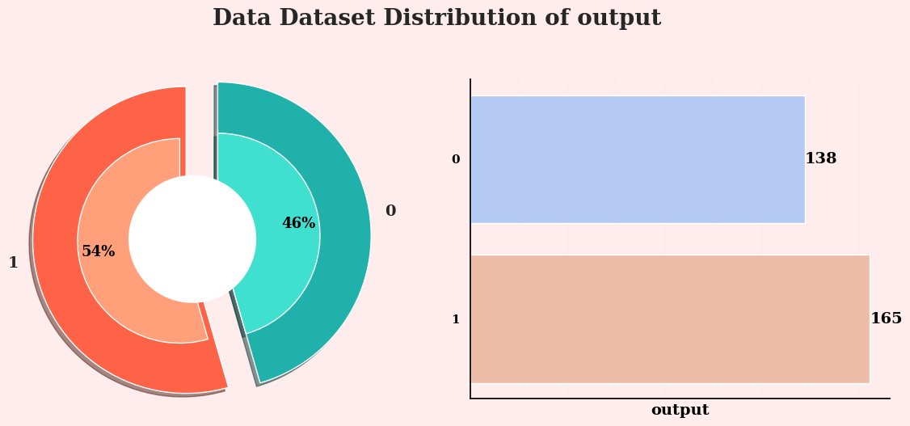
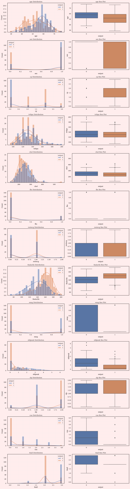
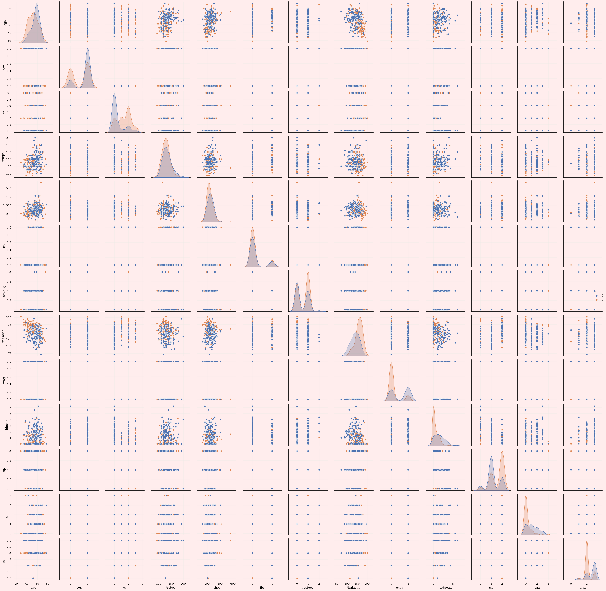
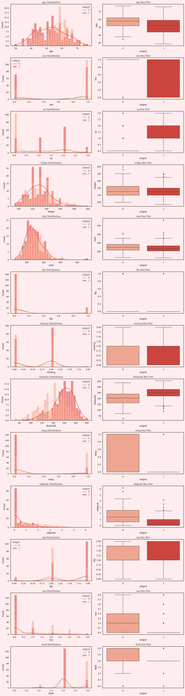
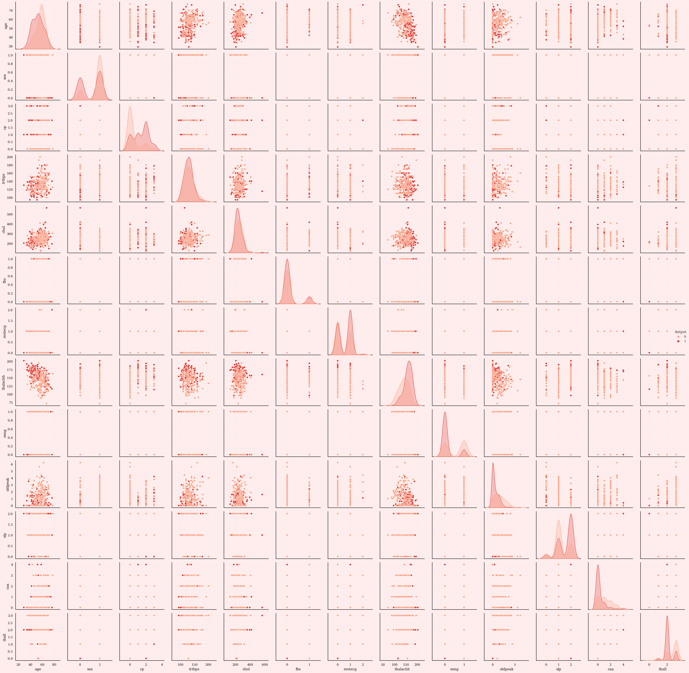

INTRODUTION:-   Predicting the Silent Threat: A Machine Learning Approach to Heart Attack Risk Assessment

Heart attacks claim millions of lives globally, often striking with devastating suddenness. This project aims to leverage the power of machine learning to predict the risk of heart attacks, potentially saving lives through early intervention and preventive measures.We will embark on a journey to build a robust prediction model, utilizing data encompassing traditional risk factors like blood pressure, cholesterol, and family history, alongside emerging indicators like genetic markers and lifestyle habits. Cutting-edge machine learning algorithms will analyze this wealth of information, identifying hidden patterns and relationships that can shed light on individual susceptibility to heart attacks.Our goal is to create a user-friendly tool that empowers individuals to understand their personal risk profile. This tool will not only provide a risk score but also offer tailored recommendations for lifestyle changes and preventative actions, promoting proactive health management.


```python
import pandas as pd
import numpy as np
import matplotlib.pyplot as plt
import seaborn as sns
import gc
import re as re
from collections import Counter


```


```python
pip install xgboost

```

    Requirement already satisfied: xgboost in c:\users\darshini\.anaconda\new folder\lib\site-packages (2.0.3)
    Requirement already satisfied: numpy in c:\users\darshini\.anaconda\new folder\lib\site-packages (from xgboost) (1.24.3)
    Requirement already satisfied: scipy in c:\users\darshini\.anaconda\new folder\lib\site-packages (from xgboost) (1.11.1)
    Note: you may need to restart the kernel to use updated packages.
    

    
    [notice] A new release of pip is available: 23.3.1 -> 24.0
    [notice] To update, run: python.exe -m pip install --upgrade pip
    


```python
from tqdm.auto import tqdm
import math
from sklearn.linear_model import LogisticRegression
from sklearn.naive_bayes import GaussianNB
from sklearn.svm import SVC
from sklearn.neighbors import KNeighborsClassifier
from sklearn.tree import DecisionTreeClassifier, plot_tree
from sklearn.ensemble import RandomForestClassifier
from sklearn.ensemble import AdaBoostClassifier
from sklearn.ensemble import GradientBoostingClassifier
from sklearn.ensemble import BaggingClassifier
from xgboost import XGBClassifier
```


```python
from xgboost import plot_tree as xgb_plot_tree
from sklearn.model_selection import KFold, StratifiedKFold, train_test_split, GridSearchCV
from sklearn.preprocessing import StandardScaler, MinMaxScaler, RobustScaler, LabelEncoder
from sklearn.metrics import precision_recall_fscore_support, roc_auc_score, accuracy_score, confusion_matrix, ConfusionMatrixDisplay, RocCurveDisplay, roc_curve, auc


from scipy.cluster import hierarchy
from scipy.cluster.hierarchy import dendrogram, linkage
from scipy.spatial.distance import squareform

```


```python
import warnings
warnings.filterwarnings('ignore')

import time
from xgboost import XGBClassifier
%matplotlib inline
tqdm.pandas()

# rc = {
#     "axes.facecolor": "#FFEDED",
#     "figure.facecolor": "#FFEDED",
#     "axes.edgecolor": "#000000",
#     "grid.color": "#EBEBE7",
#     "font.family": "serif",
#     "axes.labelcolor": "#000000",
#     "xtick.color": "#000000",
#     "ytick.color": "#000000",
#     "grid.alpha": 0.4
# }

# font = {'family': 'serif',
#         'color':  'black',
#         'weight': 'bold',
#         'size': 16,
#         }

# sns.set(rc=rc)

# from colorama import Style, Fore
# red = Style.BRIGHT + Fore.RED
# blu = Style.BRIGHT + Fore.BLUE
# mgt = Style.BRIGHT + Fore.MAGENTA
# gld = Style.BRIGHT + Fore.YELLOW
# res = Style.RESET_ALL
# bold_start = Style.BRIGHT
# bold_end = Style.NORMAL
```


```python
def describe(df):
    print(f'{bold_start}Data shape : {bold_end}{red}{df.shape}{res}')
    print(f'{bold_start}____________________________________________________________________{bold_end}')
    summ = pd.DataFrame(df.dtypes, columns=['data type'])
    summ['missing_#'] = df.isnull().sum().values 
    summ['missing_%'] = df.isnull().sum().values / len(df) * 100
    summ['unique'] = df.nunique().values
    desc = pd.DataFrame(df.describe(include='all').transpose())
    summ['mean'] = desc['mean'].values
    summ['std'] = desc['std'].values
    summ['min'] = desc['min'].values
    summ['25%'] = desc['25%'].values
    summ['50%'] = desc['50%'].values
    summ['75%'] = desc['75%'].values
    summ['max'] = desc['max'].values
    summ['1st'] = df.loc[0].values
    summ['2nd'] = df.loc[1].values
    summ['3rd'] = df.loc[2].values
    
    return summ

```


```python
def plot_count(df: pd.core.frame.DataFrame, col_list: list, title_name: str='Train') -> None:
    f, ax = plt.subplots(len(col_list), 2, figsize=(12, 5))
    plt.subplots_adjust(wspace=0.3)

    for col in col_list:
        s1 = df[col].value_counts()
        N = len(s1)
        outer_sizes = s1
        inner_sizes = s1/N
        outer_colors = ['#FF6347', '#20B2AA']
        inner_colors = ['#FFA07A', '#40E0D0']

        ax[0].pie(
            outer_sizes, colors=outer_colors, 
            labels=s1.index.tolist(), 
            startangle=90, frame=True, radius=1.2, 
            explode=([0.05]*(N-1) + [.2]),
            wedgeprops={'linewidth': 1, 'edgecolor': 'white'}, 
            textprops={'fontsize': 14, 'weight': 'bold'},
            shadow=True
        )

        ax[0].pie(
            inner_sizes, colors=inner_colors,
            radius=0.8, startangle=90,
            autopct='%1.f%%', explode=([.1]*(N-1) + [.2]),
            pctdistance=0.8, textprops={'size': 13, 'weight': 'bold', 'color': 'black'},
            shadow=True
        )

        center_circle = plt.Circle((0,0), .5, color='black', fc='white', linewidth=0)
        ax[0].add_artist(center_circle)
        sns.barplot(
            x=s1, y=s1.index, ax=ax[1],
            palette='coolwarm', orient='horizontal'
        )

        ax[1].spines['top'].set_visible(False)
        ax[1].spines['right'].set_visible(False)
        ax[1].tick_params(axis='x', which='both', bottom=False, labelbottom=False)
        ax[1].set_ylabel('')  # Remove y label
        ax[1].bar_label(ax[1].containers[0], color='black', fontweight='bold', fontsize=14)

        plt.setp(ax[1].get_yticklabels(), fontweight="bold")
        plt.setp(ax[1].get_xticklabels(), fontweight="bold")
        ax[1].set_xlabel(col, fontweight="bold", color='black', fontsize=14)

    f.suptitle(f'{title_name} Dataset Distribution of {col}', fontsize=20, fontweight='bold', y=1.05)
    plt.tight_layout()    
    plt.show()
```


```python
def plot_dist(df: pd.core.frame.DataFrame, col_list: list, target: str, title_name: str='Train') -> None:
    f, ax = plt.subplots(len(col_list), 2, figsize=(12, 5))
    plt.subplots_adjust(wspace=0.3)

    for col in col_list:
        ax[0] = sns.histplot(x=col, hue=target, data=df, bins=30, kde=True, palette='Reds')
        ax[1] = sns.boxplot(x=target, y=col, data=data)

    f.suptitle(f'{title_name} Dataset Distribution of {col}', fontsize=20, fontweight='bold', y=1.05)
    plt.tight_layout()    
    plt.show()
```


```python
def plot_correlation_heatmap(df: pd.core.frame.DataFrame, order:str='target', title_name: str='Train correlation') -> None:
    corr = df.corr()
    fig, axes = plt.subplots(figsize=(12, 8))
    mask = np.zeros_like(corr)
    mask[np.triu_indices_from(mask)] = True
    sns.heatmap(corr, mask=mask, linewidths=.5, cmap='RdBu_r', annot=True, annot_kws={"size": 8})
    plt.title(title_name, fontsize=20, fontweight='bold', y=1.05)
    plt.show()
```


```python
def perform_hierarchical_clustering(input_data, title):
    correlation_matrix = input_data.corr()
    distance_matrix = 1 - np.abs(correlation_matrix)
    Z = linkage(squareform(distance_matrix), 'complete')
    fig, ax = plt.subplots(1, 1, figsize=(14, 8), dpi=120)
    dn = dendrogram(Z, labels=input_data.columns, ax=ax, above_threshold_color='#ff0000', orientation='right', color_threshold=0.7*max(Z[:,2]))
    hierarchy.set_link_color_palette(None)  # Reset color palette to default
    plt.grid(axis='x')
    plt.title(f'{title} Hierarchical clustering, Dendrogram', fontsize=20, fontweight='bold', y=1.05)
    plt.show()
```


```python
data = pd.read_csv(r"C:\Users\darshini\Downloads\archive\heart.csv")
data.head()
```


<div>
<style scoped>
    .dataframe tbody tr th:only-of-type {
        vertical-align: middle;
    }

    .dataframe tbody tr th {
        vertical-align: top;
    }

    .dataframe thead th {
        text-align: right;
    }
</style>
<table border="1" class="dataframe">
  <thead>
    <tr style="text-align: right;">
      <th></th>
      <th>age</th>
      <th>sex</th>
      <th>cp</th>
      <th>trtbps</th>
      <th>chol</th>
      <th>fbs</th>
      <th>restecg</th>
      <th>thalachh</th>
      <th>exng</th>
      <th>oldpeak</th>
      <th>slp</th>
      <th>caa</th>
      <th>thall</th>
      <th>output</th>
    </tr>
  </thead>
  <tbody>
    <tr>
      <th>0</th>
      <td>63</td>
      <td>1</td>
      <td>3</td>
      <td>145</td>
      <td>233</td>
      <td>1</td>
      <td>0</td>
      <td>150</td>
      <td>0</td>
      <td>2.3</td>
      <td>0</td>
      <td>0</td>
      <td>1</td>
      <td>1</td>
    </tr>
    <tr>
      <th>1</th>
      <td>37</td>
      <td>1</td>
      <td>2</td>
      <td>130</td>
      <td>250</td>
      <td>0</td>
      <td>1</td>
      <td>187</td>
      <td>0</td>
      <td>3.5</td>
      <td>0</td>
      <td>0</td>
      <td>2</td>
      <td>1</td>
    </tr>
    <tr>
      <th>2</th>
      <td>41</td>
      <td>0</td>
      <td>1</td>
      <td>130</td>
      <td>204</td>
      <td>0</td>
      <td>0</td>
      <td>172</td>
      <td>0</td>
      <td>1.4</td>
      <td>2</td>
      <td>0</td>
      <td>2</td>
      <td>1</td>
    </tr>
    <tr>
      <th>3</th>
      <td>56</td>
      <td>1</td>
      <td>1</td>
      <td>120</td>
      <td>236</td>
      <td>0</td>
      <td>1</td>
      <td>178</td>
      <td>0</td>
      <td>0.8</td>
      <td>2</td>
      <td>0</td>
      <td>2</td>
      <td>1</td>
    </tr>
    <tr>
      <th>4</th>
      <td>57</td>
      <td>0</td>
      <td>0</td>
      <td>120</td>
      <td>354</td>
      <td>0</td>
      <td>1</td>
      <td>163</td>
      <td>1</td>
      <td>0.6</td>
      <td>2</td>
      <td>0</td>
      <td>2</td>
      <td>1</td>
    </tr>
  </tbody>
</table>
</div>


```python
describe(data)
```

    Data shape : (303, 14)
    ____________________________________________________________________
    


<div>
<style scoped>
    .dataframe tbody tr th:only-of-type {
        vertical-align: middle;
    }

    .dataframe tbody tr th {
        vertical-align: top;
    }

    .dataframe thead th {
        text-align: right;
    }
</style>
<table border="1" class="dataframe">
  <thead>
    <tr style="text-align: right;">
      <th></th>
      <th>data type</th>
      <th>missing_#</th>
      <th>missing_%</th>
      <th>unique</th>
      <th>mean</th>
      <th>std</th>
      <th>min</th>
      <th>25%</th>
      <th>50%</th>
      <th>75%</th>
      <th>max</th>
      <th>1st</th>
      <th>2nd</th>
      <th>3rd</th>
    </tr>
  </thead>
  <tbody>
    <tr>
      <th>age</th>
      <td>int64</td>
      <td>0</td>
      <td>0.0</td>
      <td>41</td>
      <td>54.366337</td>
      <td>9.082101</td>
      <td>29.0</td>
      <td>47.5</td>
      <td>55.0</td>
      <td>61.0</td>
      <td>77.0</td>
      <td>63.0</td>
      <td>37.0</td>
      <td>41.0</td>
    </tr>
    <tr>
      <th>sex</th>
      <td>int64</td>
      <td>0</td>
      <td>0.0</td>
      <td>2</td>
      <td>0.683168</td>
      <td>0.466011</td>
      <td>0.0</td>
      <td>0.0</td>
      <td>1.0</td>
      <td>1.0</td>
      <td>1.0</td>
      <td>1.0</td>
      <td>1.0</td>
      <td>0.0</td>
    </tr>
    <tr>
      <th>cp</th>
      <td>int64</td>
      <td>0</td>
      <td>0.0</td>
      <td>4</td>
      <td>0.966997</td>
      <td>1.032052</td>
      <td>0.0</td>
      <td>0.0</td>
      <td>1.0</td>
      <td>2.0</td>
      <td>3.0</td>
      <td>3.0</td>
      <td>2.0</td>
      <td>1.0</td>
    </tr>
    <tr>
      <th>trtbps</th>
      <td>int64</td>
      <td>0</td>
      <td>0.0</td>
      <td>49</td>
      <td>131.623762</td>
      <td>17.538143</td>
      <td>94.0</td>
      <td>120.0</td>
      <td>130.0</td>
      <td>140.0</td>
      <td>200.0</td>
      <td>145.0</td>
      <td>130.0</td>
      <td>130.0</td>
    </tr>
    <tr>
      <th>chol</th>
      <td>int64</td>
      <td>0</td>
      <td>0.0</td>
      <td>152</td>
      <td>246.264026</td>
      <td>51.830751</td>
      <td>126.0</td>
      <td>211.0</td>
      <td>240.0</td>
      <td>274.5</td>
      <td>564.0</td>
      <td>233.0</td>
      <td>250.0</td>
      <td>204.0</td>
    </tr>
    <tr>
      <th>fbs</th>
      <td>int64</td>
      <td>0</td>
      <td>0.0</td>
      <td>2</td>
      <td>0.148515</td>
      <td>0.356198</td>
      <td>0.0</td>
      <td>0.0</td>
      <td>0.0</td>
      <td>0.0</td>
      <td>1.0</td>
      <td>1.0</td>
      <td>0.0</td>
      <td>0.0</td>
    </tr>
    <tr>
      <th>restecg</th>
      <td>int64</td>
      <td>0</td>
      <td>0.0</td>
      <td>3</td>
      <td>0.528053</td>
      <td>0.525860</td>
      <td>0.0</td>
      <td>0.0</td>
      <td>1.0</td>
      <td>1.0</td>
      <td>2.0</td>
      <td>0.0</td>
      <td>1.0</td>
      <td>0.0</td>
    </tr>
    <tr>
      <th>thalachh</th>
      <td>int64</td>
      <td>0</td>
      <td>0.0</td>
      <td>91</td>
      <td>149.646865</td>
      <td>22.905161</td>
      <td>71.0</td>
      <td>133.5</td>
      <td>153.0</td>
      <td>166.0</td>
      <td>202.0</td>
      <td>150.0</td>
      <td>187.0</td>
      <td>172.0</td>
    </tr>
    <tr>
      <th>exng</th>
      <td>int64</td>
      <td>0</td>
      <td>0.0</td>
      <td>2</td>
      <td>0.326733</td>
      <td>0.469794</td>
      <td>0.0</td>
      <td>0.0</td>
      <td>0.0</td>
      <td>1.0</td>
      <td>1.0</td>
      <td>0.0</td>
      <td>0.0</td>
      <td>0.0</td>
    </tr>
    <tr>
      <th>oldpeak</th>
      <td>float64</td>
      <td>0</td>
      <td>0.0</td>
      <td>40</td>
      <td>1.039604</td>
      <td>1.161075</td>
      <td>0.0</td>
      <td>0.0</td>
      <td>0.8</td>
      <td>1.6</td>
      <td>6.2</td>
      <td>2.3</td>
      <td>3.5</td>
      <td>1.4</td>
    </tr>
    <tr>
      <th>slp</th>
      <td>int64</td>
      <td>0</td>
      <td>0.0</td>
      <td>3</td>
      <td>1.399340</td>
      <td>0.616226</td>
      <td>0.0</td>
      <td>1.0</td>
      <td>1.0</td>
      <td>2.0</td>
      <td>2.0</td>
      <td>0.0</td>
      <td>0.0</td>
      <td>2.0</td>
    </tr>
    <tr>
      <th>caa</th>
      <td>int64</td>
      <td>0</td>
      <td>0.0</td>
      <td>5</td>
      <td>0.729373</td>
      <td>1.022606</td>
      <td>0.0</td>
      <td>0.0</td>
      <td>0.0</td>
      <td>1.0</td>
      <td>4.0</td>
      <td>0.0</td>
      <td>0.0</td>
      <td>0.0</td>
    </tr>
    <tr>
      <th>thall</th>
      <td>int64</td>
      <td>0</td>
      <td>0.0</td>
      <td>4</td>
      <td>2.313531</td>
      <td>0.612277</td>
      <td>0.0</td>
      <td>2.0</td>
      <td>2.0</td>
      <td>3.0</td>
      <td>3.0</td>
      <td>1.0</td>
      <td>2.0</td>
      <td>2.0</td>
    </tr>
    <tr>
      <th>output</th>
      <td>int64</td>
      <td>0</td>
      <td>0.0</td>
      <td>2</td>
      <td>0.544554</td>
      <td>0.498835</td>
      <td>0.0</td>
      <td>0.0</td>
      <td>1.0</td>
      <td>1.0</td>
      <td>1.0</td>
      <td>1.0</td>
      <td>1.0</td>
      <td>1.0</td>
    </tr>
  </tbody>
</table>
</div>


```python
plot_count(data, ['output'], 'Data')
```


    

    


```python
num_variables = data.select_dtypes(include=[np.number]).columns.tolist()
num_variables.remove('output')

fig, ax = plt.subplots(len(num_variables), 2, figsize=(14, len(num_variables)*4))

for idx, column in enumerate(num_variables):
    sns.histplot(x=column, hue="output", data=data, bins=30, kde=True,ax=ax[idx,0])
    ax[idx,0].set_title(f"{column} Distribution")
    
    sns.boxplot(x='output', y=column, data=data, ax=ax[idx,1])
    ax[idx,1].set_title(f"{column} Box Plot")
    
plt.tight_layout() 
plt.show()
```


    

    


```python
sns.pairplot(data, hue='output')
plt.tight_layout()
plt.show()
```


    

    


```python
plot_correlation_heatmap(data, 'output', 'Data Correlation Heatmap')
```


    

    


```python
perform_hierarchical_clustering(data, title='Train data')
```


    

    


```python

```
